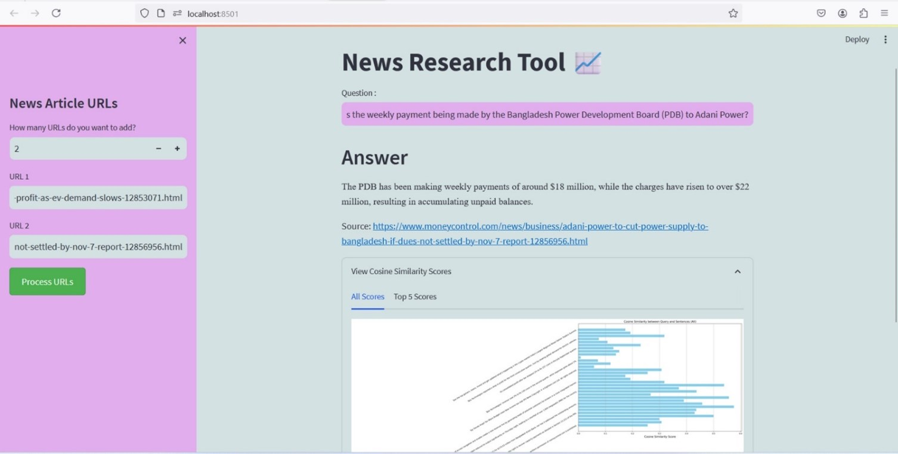
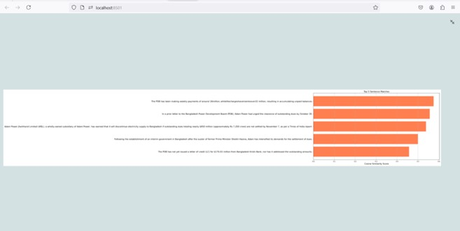

# INTELLIGENT NEWS EXTRACTION: A SENTENCE TRANSFORMER-BASED RESEARCH TOOL

***"Intelligent News Extraction: A Sentence Transformer-Based Research Tool"*** automates the extraction and analysis of online news, converting content into semantic embeddings for precise, context-aware retrieval. 

With a user-friendly interface, it streamlines information access for equity researchers, enhancing decision-making and efficiency

## *About*

In an age where information is abundant, finding relevant and precise insights from vast volumes of online news content can be overwhelming. For researchers, analysts, and professionals, manually sifting through numerous articles to extract critical information is not only time-consuming but also prone to errors. This challenge calls for an intelligent solution that can streamline the process of news analysis and retrieval. ***Our project, "Intelligent News Extraction: A Sentence Transformer-Based Research Tool,"*** addresses this need by automating the extraction, processing, and analysis of news articles, providing users with quick, accurate, and contextually relevant answers to their queries.

## *Features*

**Automated Data Extraction:** The tool allows users to input URLs, and it autonomously extracts the main content of the news articles, filtering out irrelevant information like ads or navigation menus. This ensures that only the core details are processed.

**Semantic Embedding and Vectorization:** Leveraging Sentence Transformers, the application converts the extracted text into semantic embeddings. This enables the tool to understand the context and meaning of the content, facilitating more precise and accurate analysis.

**Question-Answering System:** Users can pose questions related to the content, and the tool retrieves answers by matching the query with the stored semantic vectors. This feature eliminates the need for keyword-based search, providing more intuitive and relevant results.

**Streamlit Interface:** A user-friendly interface built on Streamlit allows seamless interaction. Users can easily input URLs, ask questions, and view results, making it accessible for those without technical expertise.

**No API Dependency:** Unlike traditional tools, this application does not rely on external APIs for data extraction. This ensures that users can fetch data without facing restrictions or limitations related to API keys.

## *Requirements*

1. **Software Requirements**

    * Programming Language: Python 3.8 or above
    Libraries and Frameworks:
        * Streamlit: For building the user interface

        * Sentence Transformers: For text embedding and semantic understanding
        * Langchain: For efficient chaining and integration of language model functionalities

        * Numpy: For numerical operations and data manipulation

        * Scikit-learn: For cosine similarity calculations

        * BeautifulSoup & Requests: For web scraping and data extraction from URLs

        * Pickle: For saving and loading model data efficiently

    * Database:
        Vector Database: To store embeddings for vector-based retrieval (can be a custom implementation using Numpy arrays)

    * Operating System: Windows, macOS, or Linux

2. **Hardware Requirements**

    * Processor: Intel Core i5 or equivalent, or higher

    * RAM: Minimum 8 GB (16 GB recommended for smoother performance with larger datasets)

    * Storage: At least 256 GB, with additional space required for storing embeddings and data files

    * GPU (Optional): Recommended for faster processing, especially when handling large datasets or performing extensive text embedding tasks

3. **Additional Tools and Services**

    * Python Environment Manager: Anaconda or virtualenv for managing dependencies

    * IDE: Visual Studio Code, PyCharm, or any preferred Python development environment

    * Browser: Latest version of Chrome, Firefox, or any compatible browser to access the Streamlit interface

## *System Architecture*


The proposed system, ***"Intelligent News Extraction: A Sentence Transformer-Based Research Tool,"*** leverages cutting-edge technologies in natural language processing and web scraping to enhance the efficiency of equity research. The *primary technology utilized in this project is the Sentence Transformer model*, specifically the **all-MiniLM-L6-v2** variant, which transforms sentences into contextual embeddings. This allows for the nuanced understanding of text, enabling the system to accurately match user queries with relevant content extracted from news articles. Additionally, **Streamlit** is employed to create an intuitive user interface, while **BeautifulSoup** facilitates the extraction of the main content from HTML pages, and **Pickle** is used for efficient data storage.

## *Project Flow*


The **flow of the project** begins with users entering the URLs of news articles into the Streamlit interface. Upon clicking the **"Process URLs"** button, the system retrieves the content and processes it to generate **sentence embeddings.** These embeddings are stored along with the original sentences and their corresponding URLs in a Pickle file. Users can then **input specific queries** to retrieve the most relevant information, with the system calculating **cosine similarity scores** to determine the **closest matches.** This streamlined process ensures that users can access vital information swiftly, enabling them to make informed decisions based on up-to-date market insights.
## *Output*
### Interface : 


### Processing 2 URLs : 




### Processing 3 URLs :


## *Project Implementation*

**To run the project :**
1. Clone the repository , make sure you have requirements.txt and main.py file
2. Install the required packages using 
```
pip install -r requirements.txt.
```
3. Run the project using 
```
streamlit run main.py.
```
**User Input** : 

Gather the Online News Article that you need to know about . The user can input the URL of the news article in the text box provided in the Streamlit interface. After providing the required URL , click process URL.

Once in the backend the embedding is done , a text box to enter the question or the query will be displayed . In that provided textbox , the user is asked to type the question and click enter .

**Output :**

On following the above process , the user will get the answer for the required question that he/she posts along with the source URL .(Source URL is nothing but the URL from where the answer is fetched.)

## *Results and Impact*
In conclusion, our proposed system stands to revolutionize equity research by integrating advanced NLP techniques and a user-friendly interface to provide a comprehensive solution for news analysis. The automation of content extraction and the generation of semantic embeddings offer a distinct advantage over traditional models, enhancing accuracy and efficiency. By minimizing manual input and focusing on delivering actionable insights, our project empowers equity researchers to navigate the complex landscape of financial news with greater agility and confidence.

In the future, we envision expanding the tool's capabilities to include features such as real-time sentiment analysis and trend forecasting, which could provide users with deeper insights. Additionally, enhancing the tool's language support will cater to a broader global audience. As we look ahead, the integration of personalized content recommendations and the potential for mobile accessibility will further empower users to tailor their news consumption experience, positioning the tool as an indispensable resource in the rapidly evolving landscape of information dissemination.

## *Articles published / References*


1. M. Alodadi and V. P. Janeja, "Similarity in Patient Support Forums Using TF-IDF and Cosine Similarity Metrics," 2015 International Conference on Healthcare Informatics, Dallas, TX, USA, 2015
2. S. Zhu, J. Wu and G. Xia, "TOP-K cosine similarity interesting pairs search," 2010 Seventh International Conference on Fuzzy Systems and Knowledge Discovery, Yantai, China, 2010.
3. V. V. Mayil and T. R. Jeyalakshmi, "Pretrained Sentence Embedding and Semantic Sentence Similarity Language Model for Text Classification in NLP," 2023 3rd International conference on Artificial Intelligence and Signal Processing (AISP), VIJAYAWADA, India, 2023
4. C. Shah, A. Shah, L. Varma, S. Bhan and N. Patil, "Sentence Restructuring with User-Controlled Difficulty using NLP," 2023 14th International Conference on Computing Communication and Networking Technologies (ICCCNT), Delhi, India, 2023.
5. S. M. M. R. Naqvi, S. Batool, M. Ahmed, H. U. Khan and M. A. Shahid, "A Novel Approach for Building Domain-Specific Chatbots by Exploring Sentence Transformers-based Encoding," 2023 International Conference on IT and Industrial Technologies (ICIT)
6. A. B. Wahyutama and M. Hwang, "Performance Comparison of Open Speech-To-Text Engines using Sentence Transformer Similarity Check with the Korean Language by Foreigners," 2022


